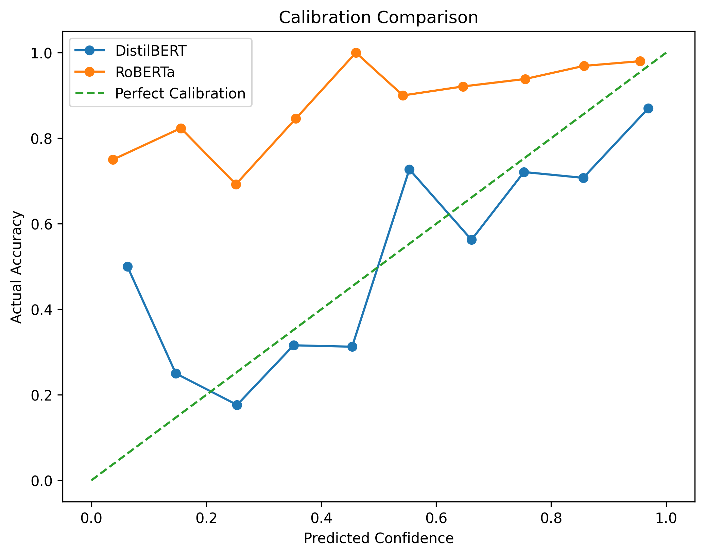
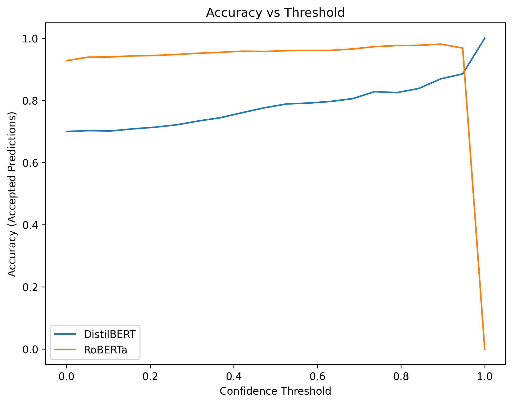
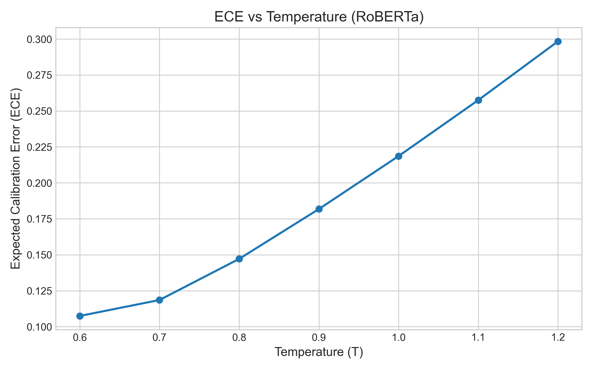

# Confidence--Correctness Mismatch in Extractive QA Models

## Overview

This project investigates how confidence aligns (or misaligns) with
correctness in extractive Question Answering (QA) systems.\
Rather than focusing purely on accuracy, we analyze reliability
behavior, calibration dynamics, and structured failure modes.

Models analyzed: - **DistilBERT** (smaller baseline model) - **RoBERTa**
(larger model, primary focus of deep behavioral analysis)

Dataset: - **SQuAD v1 (validation subset of 500 samples)**

------------------------------------------------------------------------

## Repository Structure

-   `notebooks/` --- Experiment workflows (inference, analysis, scaling)
-   `src/` --- Reusable evaluation utilities (metrics, calibration,
    threshold logic)
-   `outputs/plots/` --- Saved calibration and temperature sweep figures
-   `outputs/results/` --- Serialized inference outputs (excluded from
    Git)
-   `models/` --- Local model checkpoints (excluded from Git)

------------------------------------------------------------------------

## Installation

Clone the repository:

``` bash
git clone https://github.com/TheSkyBiz/confidence-correctness-mismatch.git
cd confidence-correctness-mismatch
```

Create virtual environment:

``` bash
python -m venv venv
source venv/bin/activate      # Linux/Mac
venv\Scripts\activate       # Windows
```

Install dependencies:

``` bash
pip install -r requirements.txt
```

------------------------------------------------------------------------

## Reproducing Results

Experiments were conducted on a fixed subset of 500 SQuAD validation
samples for deterministic comparison.

### Step 1 --- Run Inference

    notebooks/01_inference_distilbert.ipynb
    notebooks/02_inference_roberta.ipynb

Outputs saved in:

    outputs/results/

------------------------------------------------------------------------

### Step 2 --- Reliability Analysis

Run:

    notebooks/03_reliability_analysis.ipynb

This computes:

-   Accuracy
-   Overconfidence rate
-   **Weighted Expected Calibration Error (ECE)**
-   Threshold filtering curves
-   Numeric failure analysis
-   Question-type sensitivity

Plots saved in:

    outputs/plots/

------------------------------------------------------------------------

### Step 3 --- Temperature Scaling Sweep

Run:

    notebooks/04_temperature_scaling.ipynb

Applies **logit-level temperature scaling**:

    scaled_logits = logits / T

Evaluates:

-   ECE vs Temperature
-   Overconfidence vs Temperature

------------------------------------------------------------------------

# 📊 Quantitative Summary

## Base Model Comparison (500 Samples)

| Metric                  | DistilBERT | RoBERTa |
|--------------------------|------------|----------|
| **Accuracy**             | ~0.70      | ~0.926   |
| **Overconfidence Rate**  | 0.112      | 0.016    |
| **Weighted ECE**         | ~0.11      | ~0.227   |

### Interpretation

- **RoBERTa** achieves significantly higher accuracy.
- **DistilBERT** exhibits substantially higher overconfidence.
- RoBERTa starts slightly underconfident but is more calibratable.
- Accuracy alone does **not** imply better calibration.

---

## Temperature Sweep (RoBERTa)

Temperature scaling was applied by dividing start and end logits by **T** before softmax.

| Temperature (T) | ECE   | Overconfidence |
|------------------|-------|----------------|
| 0.6              | 0.107 | 0.032          |
| 0.7              | 0.118 | 0.028          |
| 0.8              | 0.147 | 0.026          |
| 1.0              | 0.218 | 0.016          |
| 1.2              | 0.298 | 0.010          |

### Observations

- Lower **T** sharpens logits → reduces ECE (better calibration).
- However, sharpening increases overconfidence risk.
- Higher **T** smooths confidence but worsens calibration.
- Calibration and overconfidence form a measurable tradeoff.

---

## Deployment Recommendation

**Recommended setting: T ≈ 0.8**

This provides:

- Significant ECE improvement
- Controlled overconfidence increase
- Strong threshold-based deployability

------------------------------------------------------------------------

## Key Findings

### 1. Accuracy ≠ Calibration

Higher accuracy does not automatically imply better probability
alignment.\
RoBERTa was initially underconfident despite strong performance.

------------------------------------------------------------------------

### 2. Threshold Filtering Reveals Deployability

Confidence thresholding improves operational reliability.\
RoBERTa shows strong deployability under filtering.

------------------------------------------------------------------------

### 3. Numeric Failures Are Selection Failures

Numeric errors were rare (7 high-confidence numeric failures).\
Errors stem from span-selection competition, not arithmetic reasoning.

------------------------------------------------------------------------

### 4. Question-Type Sensitivity

Calibration varies by question type:

-   "How many" → higher confidence, lower relative accuracy\
-   "Where" → underconfident but accurate

Miscalibration is selective, not global.

------------------------------------------------------------------------

### 5. Logit-Level Temperature Scaling

Temperature scaling at the logit level:

-   Lower T → improved calibration (lower ECE)
-   Lower T → increased overconfidence
-   Higher T → safer but worse calibration

Temperature acts as a **reliability--risk control dial**.

------------------------------------------------------------------------

## Visual Results

### Calibration Comparison



### Accuracy vs Threshold



### ECE vs Temperature



------------------------------------------------------------------------

## Limitations

-   Evaluated on 500-sample subset (not full dataset)
-   Exact match metric (no F1 span scoring)
-   No learned temperature via NLL minimization
-   Extractive QA only (no generative models)
-   Single-seed experiment

------------------------------------------------------------------------

## Conclusion

Confidence behavior is structured and tunable.\
Calibration can be controlled post-hoc using logit-level temperature
scaling.\
Deployment-aware evaluation (thresholding) provides deeper reliability
insight than accuracy alone.

The model is predictably imperfect --- and tunable.

------------------------------------------------------------------------

Built with fun and pinch of nerdiness <3.
